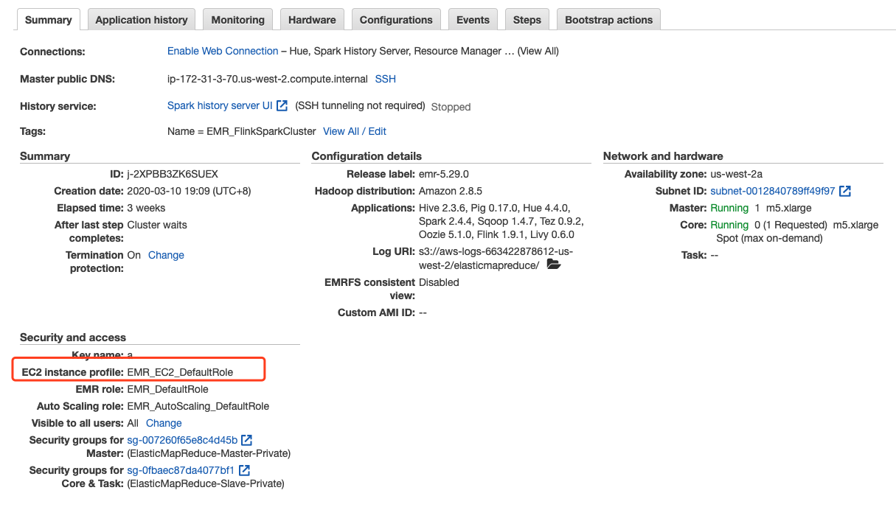
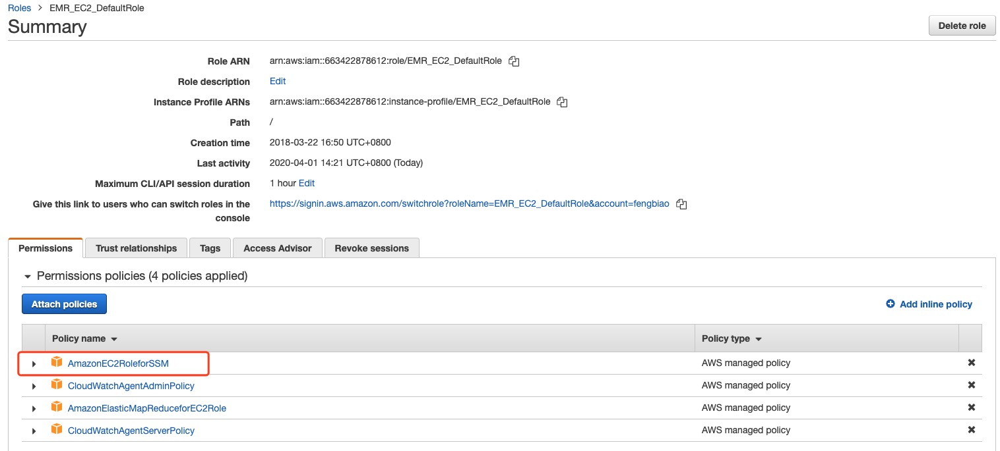
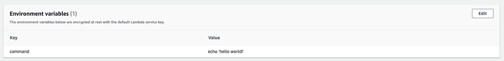

# Enable “Bootstrap“ on exist Amazon EMR cluster

**介绍：**

在日常工作中，有很多客户在创建长运行的EMR集群时忽略了启用Bootstrap选项，并且EMR当前不支持修改Bootstrap选项。这就导致了后期客户如果需要在添加新节点时自动完成一些动作，如：安装监控Agent, 其他第三方软件，软件更新等就无法实现，而长运行集群往往是带有数据和为在线业务服务的，也很难删除重新，这样会变成一个非常大的问题。特别是启用了AutoScaling时也问题尤为突出。

**解决方案**：

通过以下几个AWS服务来实现类似Bootstrap的功能，在有新节点被添加进来的时候，能在新节点上自动运行相要的命令或甚至Shell脚本。

- CloudWatch Events：负责接收EMR集群的事件信息，过滤出Instance Group Resizing事件，并触发Lambda函数

- Lambda：接收相应的消息，调用相应服务来执行命令

- System Manager：使用System Manager Run Command在节点上执行命令或脚本。

**流程**：

- 当EMR Autoscaling或手工调整Instance Group大小时会触发CloudWatch Event

- 使用Lambda函数订阅CloudWatch Event，调用System Manager Run Command，在目标EC2实例上执行命令。
- 利用目前Amazon Linux, Ubuntu 操作系统已经内置的System Manager Agent来推送命令或脚本

**使用：**

1. Enable System Manager Run Command  

    配置EMR EC2 Instance Profile的权限，在EMR控制台中找到EC2 Instance Profile的名称，

    

    然后到IAM控制台中找到相应的Role，为该Role添加名称为AmazonEC2RoleforSSM的Policy。

    

2. 部署 Lambda function.  

    - Runtime: Node.js 10.x或更高

    - 为Lambda函数创建新Role, 并附加AmazonElasticMapReduceReadonly，AmazonSSMFullAccess 两个Policy
    - 将Repo中代码上传至Lambda Function

3. 配置要执行的命令 

   为Lambda函数添加一个环境变量，名称：command, 值：需要执行的命令或Shell脚本地址

   

4. 配置CloudWatch Event 

    在CloudWatch Event -> Rules中创建规则，按照如下设置：

    **Event Pattern:**   
    Service Name: EMR  
      Event Type: State Change  
      Specific detail types: EMR Instance Group State Change  
      Specific states: RESIZING  
    **Targets:**  
      Lambda Function: 步骤2中创建的Lambda函数

    5. 在EMR集群中增加新节点进行测试
